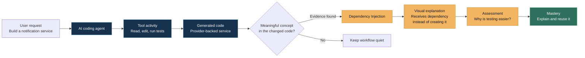
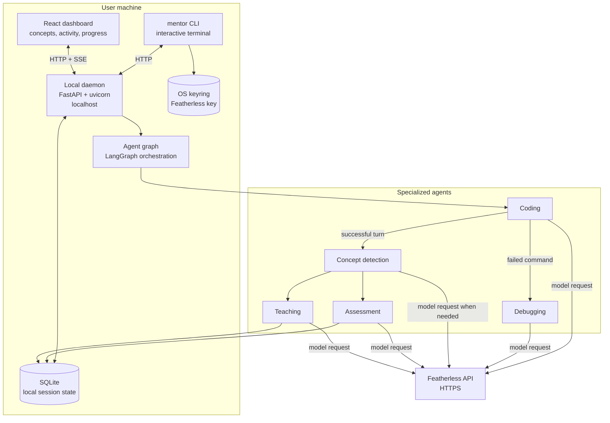

# CodeLith 
<p><strong>Build with AI. Understand what you build.</strong></p>

AI has made software development faster than ever, but it has also made it easier to build without understanding. For students and new developers especially, AI-generated code can become a black box rather than an opportunity to learn. 

CodeLith bridges this gap by combining AI-powered coding with contextual learning—as the agent builds, it identifies the concepts introduced in the code, explains them visually, assesses the user's understanding, and tracks their progress. It transforms AI-assisted coding from simply getting code to actually understanding how it works.

## How it works

CodeLith does not attach a generic lesson to a coding session. It follows the
actual work the coding agent performed, finds the important idea inside the
result, and turns that idea into a path toward independent understanding.


The learning is grounded in evidence, not in a static tutorial library:

- The **request** provides the goal.
- The **coding agent's tool activity** shows what it actually changed and ran.
- The **concept detector** identifies a meaningful technique from that change.
- The **visual explanation** makes the technique concrete in the context of
    the new code.
- The **assessment** checks whether the user can reason about the choice,
    rather than merely recognize its name.
- **Mastery** means the user can explain and reuse the idea independently.

### Three ways to work

| Mode | Best for | Behavior |
| --- | --- | --- |
| `learn` | Building understanding | Detects concepts, explains the work, and asks questions about each new concept. |
| `pair-programming` | Staying in the flow | Focuses on building while detecting concepts and asking occasional questions. |
| `autonomous` | Finishing a well-defined task | Prioritizes implementation and debugging with minimal learning interruptions. |

Switch modes from either interface. The daemon is the shared source of truth,
so the terminal and browser stay synchronized.

## Install and run

The planned public distribution is a PyPI package named `mentor-ai`:

```bash
pip install mentor-ai
mentor
```

## Commands

### In the terminal session

Typed at the `>` prompt, after the banner:

| Command | Effect |
| --- | --- |
| `exit`, `quit`, `q` | Leave the session — the daemon keeps running in the background |
| `reset`, `clear`, `/reset` | Start a fresh conversation |
| `mode` | Show the current mode and the available modes |
| `mode <name>` | Switch mode — one of `learn`, `pair-programming`, `autonomous` |

Anything else is sent to the agent. Mode changes made on the dashboard are
picked up by the terminal automatically, and vice versa.

### CLI subcommands

| Command | Effect |
| --- | --- |
| `codelith` | Chat session: first-run key setup, daemon autostart, dashboard link — opens in the browser after a short pause |
| `codelith setup [groq\|openrouter]` | Enter or re-enter an API key (validated first, saved to the OS credential store) |
| `codelith config show` | Show every model role and its resolved model |
| `codelith config set <role> <model>` | Override one role's model (e.g. `coding`, `teaching`) |
| `codelith config unset <role>` | Remove a role's override — back to the built-in default |

### Daemon control

| Command | Effect |
| --- | --- |
| `python -m backend.daemon.launcher start` | Start the daemon detached, if not already running |
| `python -m backend.daemon.launcher status` | Show whether it runs, and on which port |
| `python -m backend.daemon.launcher open` | Start it if needed, then open the dashboard in the browser |
| `python -m backend.daemon.launcher stop` | Stop the daemon |

## Architecture

CodeLith is a local three-process system: a CLI, a browser dashboard, and a
background daemon that hosts the API and the agent graph. Both frontends talk
to the same daemon, which is the single source of truth for session state
(conversation history, mode, concepts, assessments, teachings).




## Repository layout

```text
CodeLith/
├── backend/
│   ├── agents/           # coding, debug, assessment, teacher agents + concept detector
│   ├── cli/              # the `codelith` command-line interface
│   ├── daemon/           # FastAPI server, detached-process launcher, state files
│   ├── database/         # SQLite persistence: concepts, teachings, assessments
│   ├── llm/              # Groq + OpenRouter clients, key and model resolution
│   ├── orchestrator/     # LangGraph agent graph, session modes, event stream
│   └── main.py           # backend entrypoint
├── frontend/             # React dashboard (Vite + TypeScript + Mermaid)
├── tests/                # pytest suite
├── pyproject.toml        # packaging config + `codelith` entry point
└── README.md
```

## Development setup

### Backend

```bash
git clone https://github.com/your-username/CodeLith
cd CodeLith
python -m venv .venv
.venv\Scripts\activate            # Windows (bash: source .venv/Scripts/activate)
pip install -e .

```

Run from source without installing the package:

```bash
python -m backend.cli.main
```

## Connecting the LLM providers

Two API keys are used, each from a different provider:

- **`GROQ_API_KEY`** — teaching-side models: teacher explanations, assessment
  grading, concept detection, and dashboard questions. Defaults to Groq's
  `openai/gpt-oss-120b`. Get a key at [console.groq.com/keys](https://console.groq.com/keys).
- **`OPENROUTER_API_KEY`** — the coding and debug agents that read, write, and
  edit files. Defaults to `qwen/qwen3-coder-next`. Get a key at [openrouter.ai/keys](https://openrouter.ai/keys).

Keys are resolved from, in order: environment variables, the OS credential
store (when saved there via `codelith setup`), a `.env` file in the project
root, then a `.env` file in the daemon state directory (`~/.codelith/`).
The `.env` files are re-read on every request, so adding a key takes effect
immediately — no daemon restart needed.

```bash
# .env (project root, or ~/.codelith/.env for a machine-wide default)
GROQ_API_KEY=gsk_...
OPENROUTER_API_KEY=sk-or-...
```

### Customizing models (optional)

CodeLith ships with sensible models for every role and needs zero model
configuration — nothing is created or asked at startup. If you *want* a
different model for a role, set it explicitly:

```bash
codelith config                       # see every role and its resolved model
codelith config set coding anthropic/claude-sonnet-4.5
codelith config unset coding          # back to default
```

This writes `~/.codelith/config.toml` (created only by `config set` — never
automatically):

```toml
[models]
coding = "anthropic/claude-sonnet-4.5"
teaching = "openai/gpt-oss-120b"   # same model for several roles is fine
```

Roles: `coding`, `debugging`, `teaching`, `assessment`, `grading`, `detection`.
Any role you leave out keeps its built-in default. Changes take effect on the
next request — no daemon restart. An environment variable
(`CODELITH_MODEL_<ROLE>`, e.g. `CODELITH_MODEL_CODING`) overrides the file,
which is handy in CI. See `backend/llm/config.toml.example` for a template.
### Controlling the daemon

```bash
python -m backend.daemon.launcher start    # start detached if not running
python -m backend.daemon.launcher status   # is it running, on which port
python -m backend.daemon.launcher open     # start if needed, then open the dashboard
python -m backend.daemon.launcher stop     # stop it
```

### Frontend (dashboard)

```bash
cd frontend
npm install
npm run dev       # dev server with HMR on :5173, calls the daemon on :8765
npm run build     # writes backend/daemon/static/ inside the Python package
```

The production build lands directly in `backend/daemon/static/` — no copy
step. The daemon serves it automatically at `http://127.0.0.1:8765/` when
present; without it, the daemon runs API-only (the Vite dev server and the
dashboard keep working either way).

### Landing page (website)

The public landing page is a separate Next.js app under `frontend/website/`
with no connection to the Python package or the daemon:

```bash
cd frontend/website
npm install
npm run dev       # http://localhost:3000
npm run build     # static production build (deploy to Vercel with frontend/website as root)
```

### Tests

```bash
python -m pytest tests/ -v
```

The suite covers diagram routing, concept categories, Mermaid validation,
mode-based routing after coding, and a store-isolation tripwire that fails if
any test could touch the real `~/.codelith` database.


## License

MIT — see [LICENSE](LICENSE).

