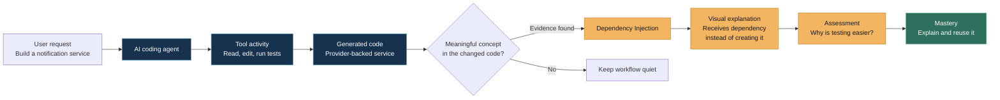
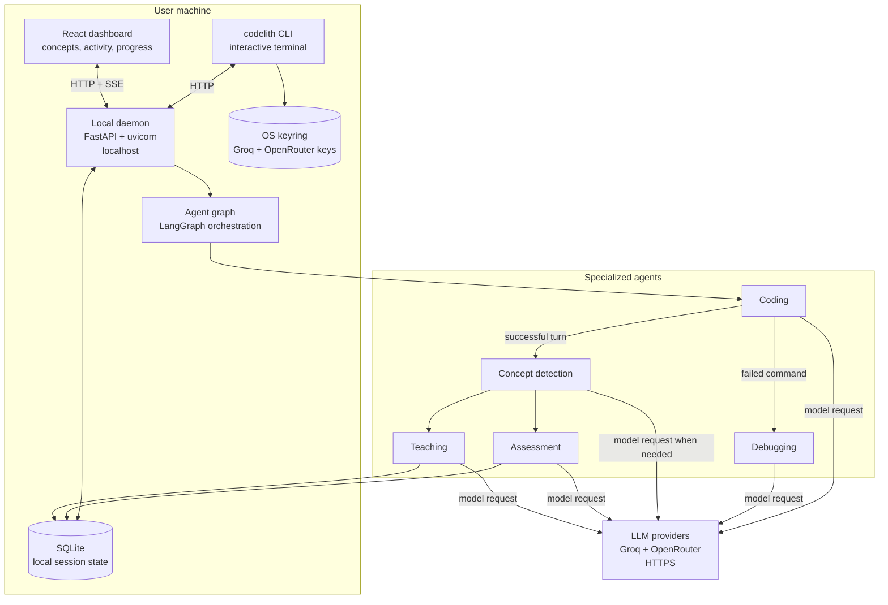

# CodeLith 
<p><strong>Build with AI. Understand what you build.</strong></p>

<strong>Problem Statement</strong> - AI has made software development faster than ever, but it has also made it easier to build without understanding. For students and new developers especially, AI-generated code can become a black box rather than an opportunity to learn. 

<strong>Solution</strong> - CodeLith bridges this gap by combining AI-powered coding with contextual learning—as the agent builds, it identifies the concepts introduced in the code, explains them visually, assesses the user's understanding, and tracks their progress. It transforms AI-assisted coding from simply getting code to actually understanding how it works.

## Prototype

<table>
  <tr>
    <th>CodeLith Terminal Agent</th>
    <th>Real-time code explanations - Dark Mode</th>
  </tr>
  <tr>
    <td></td>
    <td></td>
  </tr>
</table>

<table>
  <tr>
    <th>Track Your Learning Progress - Dark Mode</th>
    <th>Choose Your Coding Mode - Dark Mode</th>
  </tr>
  <tr>
    <td></td>
    <td></td>
  </tr>
</table>

<table>
  <tr>
    <th>Check Your Understanding - Light Mode</th>
    <th>Ask CodeLith AI - Dark Mode</th>
  </tr>
  <tr>
    <td></td>
    <td></td>
  </tr>
</table>

## How it works

CodeLith does not attach a generic lesson to a coding session. It follows the
actual work the coding agent performed, finds the important idea inside the
result, and turns that idea into a path toward independent understanding.


The learning is grounded in evidence, not in a static tutorial library:

- The **request** provides the goal.
- The **coding agent's tool activity** shows what it actually changed and ran.
- The **concept detector** identifies a meaningful technique from that change.
- The **visual explanation** makes the technique concrete in the context of
    the new code.
- The **assessment** checks whether the user can reason about the choice,
    rather than merely recognize its name.
- **Mastery** means the user can explain and reuse the idea independently.

## Key Features

- Multi-agent AI architecture using specialized coding, debugging, teaching, assessment, grading, and concept-detection agents.
- Interactive CLI with chat, mode switching, session reset, and daemon controls.
- Three working modes learn, pair-programming, and autonomous.
- Dashboard for conversations, concepts, teachings, assessments, and progress.
- Secure API-key handling through environment variables, .env files, and the operating system credential store.
- Visual Mermaid diagrams generated for programming concepts and rendered in the dashboard.
- Socratic assessments that test whether users understand concepts rather than merely recognize them.
- Automatic debugging flow when coding commands fail.

## Architecture

CodeLith is a local three-process system: a CLI, a browser dashboard, and a
background daemon that hosts the API and the agent graph. Both frontends talk
to the same daemon, which is the single source of truth for session state
(conversation history, mode, concepts, assessments, teachings).




## Repository layout

```text
CodeLith/
├── backend/
│   ├── agents/           # coding, debug, assessment, teacher agents + concept detector
│   ├── cli/              # the `codelith` command-line interface
│   ├── daemon/           # FastAPI server, detached-process launcher, state files
│   ├── database/         # SQLite persistence: concepts, teachings, assessments
│   ├── llm/              # Groq + OpenRouter clients, key and model resolution
│   ├── orchestrator/     # LangGraph agent graph, session modes, event stream
│   └── main.py           # backend entrypoint
├── frontend/             # React dashboard (Vite + TypeScript + Mermaid)
├── tests/                # pytest suite
├── pyproject.toml        # packaging config + `codelith` entry point
└── README.md
```

## Future Enhancements

- Add session export/import so users can save conversations, concepts, assessments, and progress.
- Add project/workspace awareness so CodeLith can remember the repository being studied and maintain project-specific learning context.
- Add user progress analytics: mastered concepts, recurring mistakes, learning streaks, and recommended next topics.
- Build a plugin system for custom agents, tools, concept detectors, and teaching strategies.

# First-time CodeLith setup

These steps are for users who installed CodeLith from PyPI for the first time.

## 1. Install CodeLith

Use Python 3.10 or newer:

```powershell
py -m pip install codelith
```

## 2. Start CodeLith

```powershell
codelith
```

On the first run, CodeLith asks for two API keys. Create them from the official provider pages:

- Groq: <https://console.groq.com/keys>
- OpenRouter: <https://openrouter.ai/keys>

Paste each key when prompted. CodeLith validates the key before saving it to the Windows credential store. The keys are not written to the project or printed in the terminal.

Groq powers teaching, explanations, assessment, and concept detection. OpenRouter powers the coding and debugging agents. Both keys are required for the complete experience.

After setup, CodeLith starts its local daemon and opens the dashboard in your browser. The dashboard is normally available at <http://localhost:8765/>.

Once installed, CodeLith can be launched anytime with a single command:

```bash
codelith
```

## Commands

### In the terminal session

Typed at the `>` prompt, after the banner:

| Command | Effect |
| --- | --- |
| `exit`, `quit`, `q` | Leave the session — the daemon keeps running in the background |
| `reset`, `clear`, `/reset` | Start a fresh conversation |
| `mode` | Show the current mode and the available modes |
| `mode <name>` | Switch mode — one of `learn`, `pair-programming`, `autonomous` |

Anything else is sent to the agent. Mode changes made on the dashboard are
picked up by the terminal automatically, and vice versa.

### CLI subcommands

| Command | Effect |
| --- | --- |
| `codelith` | Chat session: first-run key setup, daemon autostart, dashboard link — opens in the browser after a short pause |
| `codelith setup [groq\|openrouter]` | Enter or re-enter an API key (validated first, saved to the OS credential store) |
| `codelith config show` | Show every model role and its resolved model |
| `codelith config set <role> <model>` | Override one role's model (Available agent roles are `coding`, `debugging`, `teaching`, `assessment`,`grading`, and `detection`.) |
| `codelith config unset <role>` | Remove a role's override — back to the built-in default |

### Daemon control

| Command | Effect |
| --- | --- |
| `python -m backend.daemon.launcher start` | Start the daemon detached, if not already running |
| `python -m backend.daemon.launcher status` | Show whether it runs, and on which port |
| `python -m backend.daemon.launcher open` | Start it if needed, then open the dashboard in the browser |
| `python -m backend.daemon.launcher stop` | Stop the daemon |


### Three ways to work

| Mode | Best for | Behavior |
| --- | --- | --- |
| `learn` | Building understanding | Detects concepts, explains the work, and asks questions about each new concept. |
| `pair-programming` | Staying in the flow | Focuses on building while detecting concepts and asking occasional questions. |
| `autonomous` | Finishing a well-defined task | Prioritizes implementation and debugging with minimal learning interruptions. |

Switch modes from either interface.

## Development setup

### Backend

```bash
git clone https://github.com/MakersNeedMore-MnM/Round2-himanibagale
cd Round2-himanibagale
python -m venv .venv
.venv\Scripts\activate            # Windows (bash: source .venv/Scripts/activate)
pip install -e .

```

Run from source without installing the package:

```bash
python -m backend.cli.main
```

### Frontend (dashboard)

```bash
cd frontend
npm install
npm run dev       # dev server with HMR on :5173, calls the daemon on :8765
npm run build     # writes backend/daemon/static/ inside the Python package
```
### Tests

```bash
python -m pytest tests/ -v
```
## Contributing

Want to contribute? Check out our [Contributing Guide](https://github.com/MakersNeedMore-MnM/Round2-himanibagale/blob/main/CONTRIBUTING.md).

## Tech Stack
### Frontend
- React
- TypeScript
- Vite
- Mermaid
- Next.js

### Backend
- Python
- SQLite
- LangGraph

### LLM/AI services
- Groq
- OpenRouter

## Team members
[Himani Bagale](https://github.com/Himani78116)

## License

MIT — see [LICENSE](https://github.com/MakersNeedMore-MnM/Round2-himanibagale/blob/main/LICENSE).

