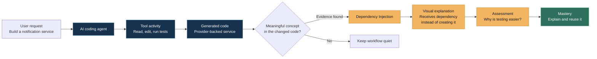
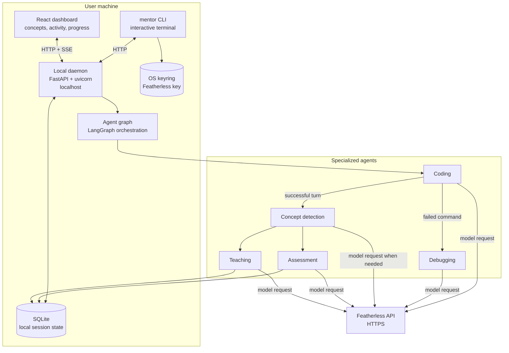

# CodeLith 
<p><strong>Build with AI. Understand what you build.</strong></p>

AI has made software development faster than ever, but it has also made it easier to build without understanding. For students and new developers especially, AI-generated code can become a black box rather than an opportunity to learn. 

CodeLith bridges this gap by combining AI-powered coding with contextual learning—as the agent builds, it identifies the concepts introduced in the code, explains them visually, assesses the user's understanding, and tracks their progress. It transforms AI-assisted coding from simply getting code to actually understanding how it works.

## How it works

CodeLith does not attach a generic lesson to a coding session. It follows the
actual work the coding agent performed, finds the important idea inside the
result, and turns that idea into a path toward independent understanding.


The learning is grounded in evidence, not in a static tutorial library:

- The **request** provides the goal.
- The **coding agent's tool activity** shows what it actually changed and ran.
- The **concept detector** identifies a meaningful technique from that change.
- The **visual explanation** makes the technique concrete in the context of
    the new code.
- The **assessment** checks whether the user can reason about the choice,
    rather than merely recognize its name.
- **Mastery** means the user can explain and reuse the idea independently.

### Three ways to work

| Mode | Best for | Behavior |
| --- | --- | --- |
| `learn` | Building understanding | Detects concepts, explains the work, and asks questions about each new concept. |
| `pair-programming` | Staying in the flow | Focuses on building while detecting concepts and asking occasional questions. |
| `autonomous` | Finishing a well-defined task | Prioritizes implementation and debugging with minimal learning interruptions. |

Switch modes from either interface. The daemon is the shared source of truth,
so the terminal and browser stay synchronized.

## Install and run

The planned public distribution is a PyPI package named `mentor-ai`:

```bash
pip install mentor-ai
mentor
```

## Architecture

CodeLith is a local three-process system: a CLI, a browser dashboard, and a
background daemon that hosts the API and the agent graph. Both frontends talk
to the same daemon, which is the single source of truth for session state
(conversation history, mode, concepts, assessments, teachings).




## Repository layout

```text
CodeLith/
├── backend/
│   ├── agents/           # coding, debug, assessment, teacher agents + concept detector
│   ├── cli/              # the `codelith` command-line interface
│   ├── daemon/           # FastAPI server, detached-process launcher, state files
│   ├── database/         # SQLite persistence: concepts, teachings, assessments
│   ├── llm/              # Groq + OpenRouter clients, key and model resolution
│   ├── orchestrator/     # LangGraph agent graph, session modes, event stream
│   └── main.py           # backend entrypoint
├── frontend/             # React dashboard (Vite + TypeScript + Mermaid)
├── tests/                # pytest suite
├── pyproject.toml        # packaging config + `codelith` entry point
└── README.md
```

## Development setup

### Backend

```bash
git clone https://github.com/your-username/CodeLith
cd CodeLith
python -m venv .venv
.venv\Scripts\activate            # Windows (bash: source .venv/Scripts/activate)
pip install -e .

```

Run from source without installing the package:

```bash
python -m backend.cli.main
```

## Connecting the LLM providers

Two API keys are used, each from a different provider:

- **`GROQ_API_KEY`** — teaching-side models: teacher explanations, assessment
  grading, concept detection, and dashboard questions. Defaults to Groq's
  `openai/gpt-oss-120b`. Get a key at [console.groq.com/keys](https://console.groq.com/keys).
- **`OPENROUTER_API_KEY`** — the coding and debug agents that read, write, and
  edit files. Defaults to `qwen/qwen3-coder-next`; change it with
  `CODELITH_AGENT_MODEL` (any OpenRouter slug, e.g.
  `anthropic/claude-sonnet-4.5` for the strongest agentic coder, or any
  `...:free` model). Get a key at [openrouter.ai/keys](https://openrouter.ai/keys).

Keys are resolved from, in order: environment variables, a `.env` file in the
project root, then a `.env` file in the daemon state directory (`~/.codelith/`).
The files are re-read on every request, so adding a key takes effect
immediately — no daemon restart needed.

```bash
# .env (project root, or ~/.codelith/.env for a machine-wide default)
GROQ_API_KEY=gsk_...
OPENROUTER_API_KEY=sk-or-...
# Optional: pick a different coding-agent model
# CODELITH_AGENT_MODEL=anthropic/claude-sonnet-4.5
```
### Controlling the daemon

```bash
python -m backend.daemon.launcher start    # start detached if not running
python -m backend.daemon.launcher status   # is it running, on which port
python -m backend.daemon.launcher stop     # stop it
```

### Frontend

```bash
cd frontend
npm install
npm run dev       # dev server with hot reload, proxies API calls to :8765
npm run build     # production build, copied into the package's static folder
```

### Tests

```bash
python -m pytest tests/ -v
```

The suite covers diagram routing, concept categories, Mermaid validation,
mode-based routing after coding, and a store-isolation tripwire that fails if
any test could touch the real `~/.codelith` database.


## License

MIT — see [LICENSE](LICENSE).

